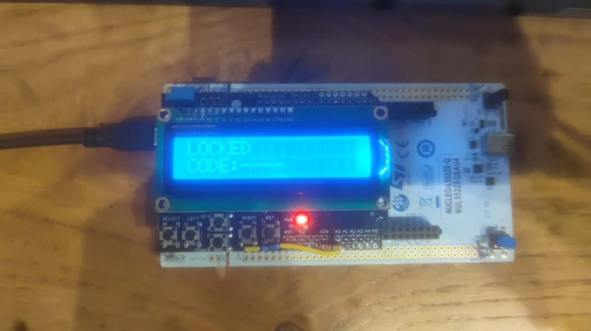
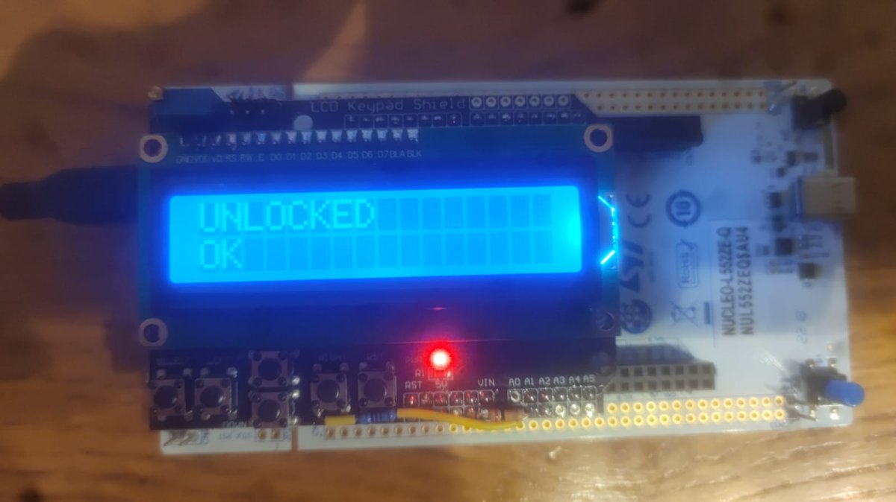

# Electronic Safe - STM32L5 Firmware

A bare-metal (HAL-based) electronic combination safe running on an STM32L5 Nucleo board with an HD44780 character LCD + analog keypad shield.

The master code is programmed once over the serial terminal at power-up. Afterwards the safe is unlocked by entering the same 4-digit sequence on the shield's buttons. Wrong codes, entry timeouts, and a long-press reset are all handled by a small explicit state machine.

**Authors:** Maor Mordo & Buraq Yassin

---

## The safe in action

<p align="center">
  
  <br>
  <em>Idle locked state - waiting for the first keypad press. Four dashes mark the empty code slots.</em>
</p>

<p align="center">
  
  <br>
  <em>After a correct 4-digit entry - the safe is open.</em>
</p>

---

## Table of contents

1. [The safe in action](#the-safe-in-action)
2. [Hardware](#hardware)
3. [How it works](#how-it-works)
4. [State machine](#state-machine)
5. [Peripheral configuration](#peripheral-configuration)
6. [Timing model](#timing-model)
7. [Source file map](#source-file-map)
8. [Key functions](#key-functions)
9. [Building and running](#building-and-running)
10. [Usage walkthrough](#usage-walkthrough)
11. [Design notes and known limitations](#design-notes-and-known-limitations)

---

## Hardware

| Item | Details |
|---|---|
| MCU | **STM32L552ZET6Q** (Cortex-M33, TrustZone-capable; used in non-secure/single-domain mode) |
| Board | **NUCLEO-L552ZE-Q** - LPUART1 on **PG7/PG8** is the ST-LINK Virtual COM Port, `VddIO2` is enabled for port G |
| Display | **LCD Keypad Shield** (Arduino form factor) with an HD44780-compatible 16×2 character LCD, driven in **4-bit mode** |
| Keypad | Resistor-ladder keypad (LCD Keypad Shield style) on a **single analog line**, read via **ADC1_IN7 / PA2** |
| User button | On-board blue button (`BLUE_BUTTON_Pin`, active-high, polled) |
| Serial | 115200 8N1, no flow control, over the ST-LINK VCP |

### Pin usage

Pin *numbers* live in the CubeMX-generated `main.h` / `lcd.h` (not included in this listing), but the port grouping is fixed by `MX_GPIO_Init()`:

| Signal | Port | Direction |
|---|---|---|
| `LCD_RS`, `LCD_D7`, `LCD_D4` | GPIOF | Output push-pull, low speed |
| `LCD_D6`, `LCD_D5` | GPIOE | Output push-pull, low speed |
| `LCD_BL` (backlight), `LCD_E` (enable) | GPIOD | Output push-pull, low speed |
| `KEY_ADC` | PA2 | Analog (ADC1_IN7) |
| `LPUART1_TX` / `LPUART1_RX` | PG7 / PG8 | AF8, requires `HAL_PWREx_EnableVddIO2()` |
| `BLUE_BUTTON` | GPIOC | Digital input, no pull, polled |

Only D4–D7 of the LCD are wired; R/W is assumed tied to ground (the driver is write-only and never polls the busy flag).

### Keypad ADC thresholds

`Read_LCD_Button_Raw()` classifies a 12-bit conversion (0–4095):

| ADC range | Button | Digit value |
|---|---|---|
| `< 50` | RIGHT | 4 |
| `< 500` | UP | 2 |
| `< 1100` | DOWN | 3 |
| `< 1600` | LEFT | 1 |
| `< 2500` | SELECT | 0 |
| otherwise | *none pressed* | - |

`BTN_NONE` is deliberately defined as `5` so it can never collide with the 0–4 digit values stored in the code arrays.

---

## How it works

1. **Setup.** On reset the firmware prints a banner over LPUART1 and waits for four ASCII characters in the range `'0'`–`'4'`. Each is converted to a numeric digit and stored in `master_code[]`. Non-matching characters are silently ignored and reception is re-armed.
2. **Locked.** Once four digits are captured, the LCD shows `LOCKED` / `CODE:----` and the safe waits for keypad input.
3. **Entry.** The first button press starts a 5-second timer and switches to input mode. Each press appends a digit (the button's enum value) to `user_code[]` and paints a `*` over the corresponding dash.
4. **Verdict.** On the fourth press the codes are compared byte-for-byte: match → `UNLOCKED / OK`, mismatch → `LOCKED / ERROR`.
5. **Recovery.** From the error or timeout screens, any button press returns to the idle locked screen. Holding the blue button for 2 seconds forces a return to locked idle from any state (the master code is preserved).

---

## State machine

```
                 ┌──────────────┐
   power-on ────►│  SETUP_UART  │  banner sent, waiting for 4 UART digits
                 └──────┬───────┘
                        │ 4th valid digit received (in RX ISR)
                        ▼
                 ┌──────────────┐◄────────── any button press
        ┌───────►│ LOCKED_IDLE  │◄────┐      (from ERROR / TIMEOUT)
        │        └──────┬───────┘     │
        │               │ 1st press: latch t_start
        │               ▼             │
        │        ┌──────────────┐     │
        │        │ LOCKED_INPUT │─────┼──► >5 s idle ──► LOCKED_TIMEOUT
        │        └──────┬───────┘     │
        │               │ 4th digit   │
        │        ┌──────┴───────┐     │
        │        │              │     │
        │   codes match    codes differ
        │        │              │     │
        │        ▼              ▼     │
        │  ┌───────────┐  ┌──────────────┐
        │  │ UNLOCKED  │  │ LOCKED_ERROR │
        │  └─────┬─────┘  └──────┬───────┘
        │        │               │
        └────────┴───────────────┘
           blue button held 2 s  (from any state except SETUP_UART)
```

| State | LCD line 1 | LCD line 2 | Accepts keypad? |
|---|---|---|---|
| `SETUP_UART` | *(blank)* | *(blank)* | No - UART only |
| `LOCKED_IDLE` | `LOCKED` | `CODE:----` | Yes, starts entry |
| `LOCKED_INPUT` | `LOCKED` | `CODE:*---` … | Yes, appends digit |
| `UNLOCKED` | `UNLOCKED` | `OK` | No - blue button only |
| `LOCKED_ERROR` | `LOCKED` | `ERROR` | Yes, any key → idle |
| `LOCKED_TIMEOUT` | `LOCKED` | `TIMEOUT` | Yes, any key → idle |

---

## Peripheral configuration

### Clock tree (`SystemClock_Config`)

```
MSI @ 4 MHz (RCC_MSIRANGE_6)
  └─► PLL:  M=1, N=55, R=2   →  4 × 55 / 2 = 110 MHz
        └─► SYSCLK = 110 MHz
              ├─ AHB  ÷1 → HCLK  = 110 MHz
              ├─ APB1 ÷1 → PCLK1 = 110 MHz
              └─ APB2 ÷1 → PCLK2 = 110 MHz
```

Voltage scaling is set to `PWR_REGULATOR_VOLTAGE_SCALE0` and flash latency to `FLASH_LATENCY_5`, both required at 110 MHz. Instruction cache (ICACHE) is enabled in 1-way direct-mapped mode.

### ADC1

12-bit, single-ended, software-triggered, single conversion, scan and continuous modes disabled, sampling time 2.5 cycles, clocked from SYSCLK. `HAL_ADCEx_Calibration_Start()` runs once at boot. Conversions are performed on demand by `ADC_ReadOnce()` using a blocking poll with a 10 ms timeout.

### LPUART1

115200 baud, 8N1, TX+RX, FIFO disabled, clocked from PCLK1.

* **RX** - interrupt-driven, one byte at a time, re-armed inside `HAL_UART_RxCpltCallback()`.
* **TX** - DMA (DMA1_Channel1 via DMAMUX, memory→peripheral, byte alignment, normal mode, non-privileged channel attributes).

Transmission goes through `UART_SendDMA()`, which copies the payload into a private 256-byte buffer and guards it with a `uart_tx_busy` flag, so the caller never has to keep the source alive. If a transfer is already in flight the call returns `HAL_BUSY` and the message is dropped. The flag is cleared in both `HAL_UART_TxCpltCallback()` and `HAL_UART_ErrorCallback()`.

### TIM2

Free-running time base used for all timeout measurement - no interrupt is used for timing logic, the counter is simply sampled.

| Parameter | Value |
|---|---|
| Prescaler | `11000 - 1` → 110 MHz / 11000 = **10 kHz** |
| Tick | **100 µs** |
| Period (ARR) | `60000 - 1` → wraps every **6.0 s** |
| Counter mode | Up |

---

## Timing model

| Constant | Value | Meaning |
|---|---|---|
| `TIMEOUT_MS` | 5000 | Code-entry window in milliseconds |
| `TIMEOUT_TICKS` | 50000 | Same window in 100 µs ticks |
| `BLUE_RESET_TICKS` | 20000 | 2 s long-press threshold |
| `TIMER_PERIOD` | 60000 | TIM2 wrap value, used by `ELAPSED()` |

`ELAPSED(start, now)` computes the tick difference and corrects for a single counter wrap:

```c
if (now >= start)  return now - start;
else               return (TIMER_PERIOD - start) + now;   /* wrapped once */
```

Because the counter wraps every 6 s and both thresholds (5 s and 2 s) are shorter than that, a single-wrap correction is sufficient - provided the main loop samples the counter more often than once per period, which it does.

---

## Source file map

| File | Role |
|---|---|
| `main.c` | Application: state machine, button scanning, timeouts, UART setup protocol, all peripheral init |
| `lcd.c` | HD44780 4-bit driver (init sequence, commands, cursor, string/char output) |
| `stm32l5xx_hal_msp.c` | Low-level peripheral init: clocks, GPIO alternate functions, DMA linkage, NVIC priorities |
| `stm32l5xx_it.c` | Interrupt vectors: SysTick, DMA1_Channel1, TIM2, LPUART1, EXTI13, fault handlers |
| `system_stm32l5xx.c` | CMSIS `SystemInit()`, `SystemCoreClockUpdate()`, prescaler tables |
| `syscalls.c` | Newlib stubs (`_write`, `_read`, `_sbrk` support functions, etc.) |
| `sysmem.c` | `_sbrk()` heap allocator bounded by `_estack` / `_Min_Stack_Size` |

Not included in this listing but required to build: `main.h`, `lcd.h`, the CubeMX `.ioc` project file, the linker script, the startup assembly file, and the STM32L5 HAL/CMSIS drivers.

---

## Key functions

### `main.c`

| Function | Purpose |
|---|---|
| `Safe_Reset()` | Enters `SETUP_UART`, clears indices, prints the banner, arms UART RX |
| `CheckButtons()` | Edge-detecting keypad handler - acts only on a none→pressed transition |
| `Read_LCD_Button_Raw()` | Maps one ADC sample to a `Button` |
| `CompareCodes()` | Byte-wise comparison of `master_code` and `user_code` |
| `ReturnToLockedIdle()` | Clears entry state and repaints the idle screen |
| `TIMER_NOW()` / `ELAPSED()` | TIM2 counter read and wrap-safe difference |
| `UART_SendDMA()` | Buffered, non-blocking transmit with busy guard |
| `ADC_ReadOnce()` | Start → poll → read → stop, returns 0 on failure |
| `HAL_UART_RxCpltCallback()` | Collects master-code digits, echoes them, transitions to `LOCKED_IDLE` |
| `LCD_Show*()` | The five fixed screens (empty/progress/unlocked/error/timeout) |

### `lcd.c`

| Function | Purpose |
|---|---|
| `LCD_Init()` | Backlight on, 50 ms power-up wait, the 0x03/0x03/0x03/0x02 4-bit handshake, then function set, display on, entry mode, clear |
| `LCD_Clear()` | Clear display (with the extra 2 ms the controller requires) |
| `LCD_SetCursor(col,row)` | DDRAM address = `0x80 | (col + {0x00, 0x40}[row])` |
| `LCD_Print()` / `LCD_WriteChar()` / `LCD_PrintAt()` | Text output |
| `LCD_Write4Bits()` / `LCD_PulseEnable()` / `LCD_Send()` | Internal nibble, strobe, and byte-framing helpers |

---

## Building and running

**Toolchain:** STM32CubeIDE (the sources carry CubeMX `USER CODE BEGIN/END` markers, so regenerating from the `.ioc` preserves the application code).

1. Open the project in STM32CubeIDE (*File → Open Projects from File System*).
2. Build (Ctrl+B) and flash to the board via ST-LINK (Run / Debug).
3. Open a serial terminal on the ST-LINK VCP at **115200 8N1**.
4. Reset the board - the setup banner should appear immediately.

Note that flashing may fail if the board's TrustZone option byte (`TZEN`) is enabled; the project assumes a non-secure/single-domain configuration.

---

## Usage walkthrough

```
--- terminal after reset ---
SET CODE (4 digits, 0-4):
0=SELECT,
1=LEFT,
2=UP,
3=DOWN,
4=RIGHT
```

Type e.g. `2031` → the digits are echoed as you type, then:

```
Code Set! Safe Locked.
```

LCD now reads:

```
LOCKED
CODE:----
```

Press **UP, SELECT, DOWN, LEFT** (= 2, 0, 3, 1) within 5 seconds of the first press. Each press adds a `*`:

```
LOCKED
CODE:*---   →   CODE:**--   →   CODE:***-   →   CODE:****
```

Then:

* correct → `UNLOCKED / OK`
* incorrect → `LOCKED / ERROR` - press any key to retry
* too slow → `LOCKED / TIMEOUT` - press any key to retry

Hold the blue button for 2 seconds at any time to return to the locked idle screen. The master code survives - only a hardware reset lets you set a new one.

---

## Design notes and known limitations

**Concurrency.** `state`, `uart_index`, `input_index`, `timeout_latched`, `uart_tx_busy`, `uart_pending_code_set_msg`, and `uart_rx` are all `volatile` because they cross the ISR/main-loop boundary. The "Code Set!" message is deliberately *not* sent from the RX callback: the ISR raises `uart_pending_code_set_msg`, and the main loop transmits it once the DMA channel is free. This keeps the ISR short and avoids a `HAL_BUSY` collision with the digit echo that was just queued.

**Blocking LCD writes.** `LCD_PulseEnable()` uses three `HAL_Delay(1)` calls, so every enable strobe costs ~3 ms and every byte (two nibbles) costs ~6 ms. A full screen repaint is therefore on the order of 100 ms, during which buttons are not scanned and the timeout is not evaluated. This is harmless at human timescales - and it doubles as de-facto switch debouncing - but it does mean the 5 s timeout can be checked up to ~100 ms late. Replacing the delays with microsecond-scale busy-waits (the HD44780 only needs ~450 ns of enable pulse width and ~37 µs of execution time) would make the UI far more responsive.

**Busy-flag polling is not used.** The driver is write-only and relies purely on worst-case delays, which is why R/W must be grounded.

**GPIO state cast.** `LCD_Write4Bits()` passes `(nibble & 0x02)` etc. directly as a `GPIO_PinState`. HAL treats any non-zero value as "set", so this works, but the values (2, 4, 8) fall outside the enum's defined range - worth a cast to `(GPIO_PinState)(!!(nibble & mask))` if strict conformance matters.

**Unused EXTI path.** `stm32l5xx_it.c` provides `EXTI13_IRQHandler()`, but `MX_GPIO_Init()` configures the blue button as a plain `GPIO_MODE_INPUT` and the main loop polls it. The handler is therefore dead code - either switch the pin to `GPIO_MODE_IT_*` or drop the vector.

**Single-wrap timing assumption.** `ELAPSED()` corrects for one TIM2 wrap only. Any interval longer than the 6 s period would alias to a wrong value; with a 5 s maximum threshold and continuous polling this cannot occur, but it is a constraint to keep in mind if the timeout is ever lengthened.

**Dropped UART output.** `UART_SendDMA()` returns `HAL_BUSY` rather than queuing when a transfer is in flight, so rapid typing during setup can drop echo characters. The digits themselves are never lost - only their echo.

**No entry-attempt limit.** Wrong codes can be retried indefinitely; there is no lockout, backoff, or attempt counter. The master code is stored in plain RAM and lost on power-down.

**No `UNLOCKED` exit via keypad.** Once unlocked, only the blue button long-press (or a reset) changes state. That is intentional but worth stating explicitly.
